# Glimmora ONE — Testing Guide

A step-by-step QA walkthrough of every surface, both as a happy-path flow and per role. Every step has a "what to do" and an "expected result." Screenshots live in `docs/screenshots/`.

> **Test environment**
> - Backend: `http://127.0.0.1:8000` (FastAPI)
> - Frontend: `http://127.0.0.1:3000` (Next.js)
> - Bootstrap superadmin: `superadmin / ChangeMe!2026` (created on first start)
> - Reset state by deleting `backend/dev.db` and restarting the API (re-seeds demo content + superadmin).

---

## 0. Roles & responsibilities at a glance

| Role | Can read | Can write | Can publish content | Can review applications | Default route |
|---|---|---|---|---|---|
| **Anonymous** | landing, pricing, login, signup | — | — | — | `/` |
| **Member** (default after signup) | dashboard, companion, stories (free + paywall hint on premium), reflect, circles, profile | own reflections, companion chats, circle posts (anonymous handle), creator application | — | — | `/dashboard` |
| **Creator** | everything a member can | own series + episodes | yes, via `/creator` | — | `/dashboard` |
| **Admin** | everything | — | — | yes (`/admin`) | `/admin` |
| **Superadmin** | everything | full | yes | yes + manage admins | `/admin` |

The role is shown in the left sidebar (`Member · free`, `Creator · free`, etc.) and on the **Profile → Your role** card.

---

## 1. Happy-path full flow (Member)

These steps run end-to-end as a brand-new visitor. Time: ~5 min.

### 1.1 Landing
**Do:** visit `http://127.0.0.1:3000/`
**Expected:** marketing landing renders with hero "A calm room for your inner life.", three feature cards, and a CTA "Begin gently." Theme toggle in the header.
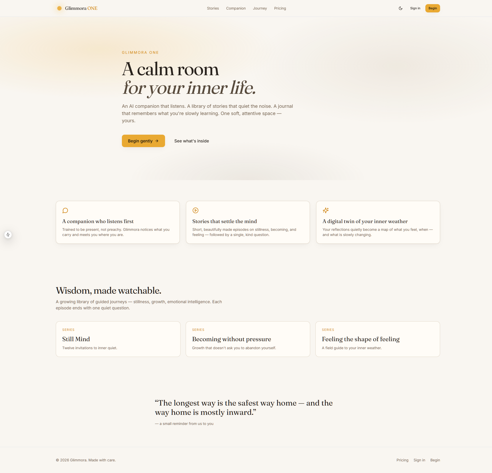

### 1.2 Theme toggle
**Do:** click the sun/moon icon in the header.
**Expected:** the page switches between light and dark mode immediately; choice persists across reloads (stored in `localStorage` under `glimmora-theme`). No flash of wrong theme on next load.

### 1.3 Sign up
**Do:** click **Begin gently** → fill the form. Username and password are required and may be a single character; email is **optional**. Submit.
**Expected:** redirected directly to `/onboarding`. The sidebar is visible and shows your name, role (`Member`), and tier (`free`).
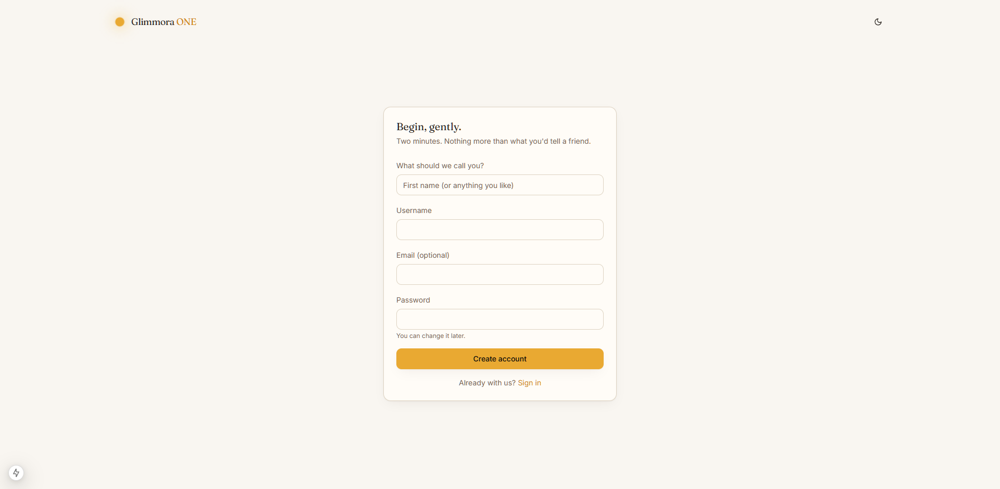

### 1.4 Onboarding (4 steps)
**Do:** walk through:
1. **Welcome** — enter a friendly name and a one-line reason.
2. **Intention** — one sentence direction (e.g. *"I'd like to feel less rushed in the mornings"*).
3. **Focus** — pick up to four areas (Stillness, Becoming, Feeling, Grief, Joy, Relationships, Work, Sleep, Creativity).
4. **Begin** — review screen showing your intention.

You can press **Skip for now →** at any step.
**Expected:** clicking **Begin** lands on `/dashboard`. The companion has already silently created a welcome conversation. Onboarding cannot be re-entered for an already-onboarded user.
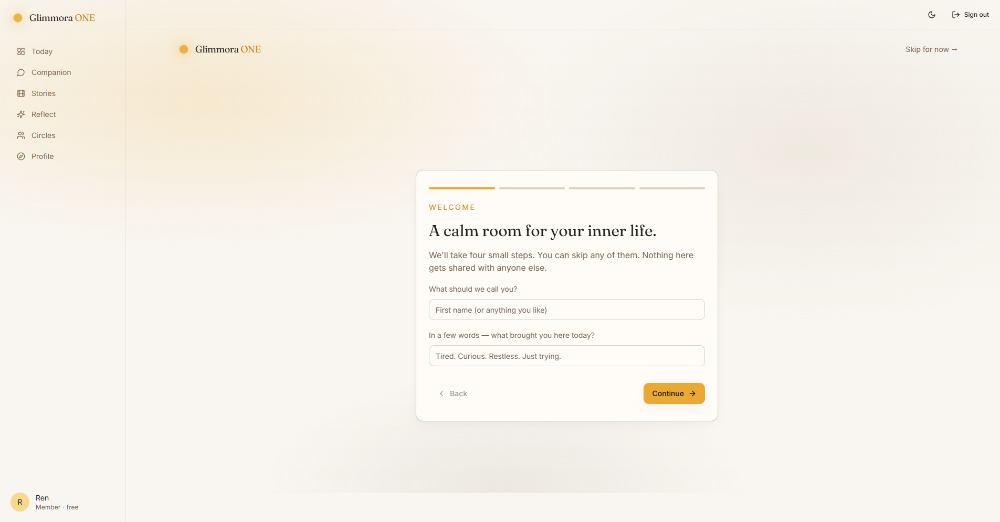

### 1.5 Dashboard (Today)
**Do:** read the dashboard.
**Expected:** four bands rendered top-to-bottom:
- **Greeting** + your intention quoted underneath.
- **Three small steps** card (Arrive / Notice / Reflect) with `0 of 3 · streak 0`.
- **Featured journey** + **Your inner weather** stats.
- **Paths for you** — series matched to your focus areas (or first 4 series if you skipped).
- **Become-a-creator** dashed callout (only if you're a member with no application).
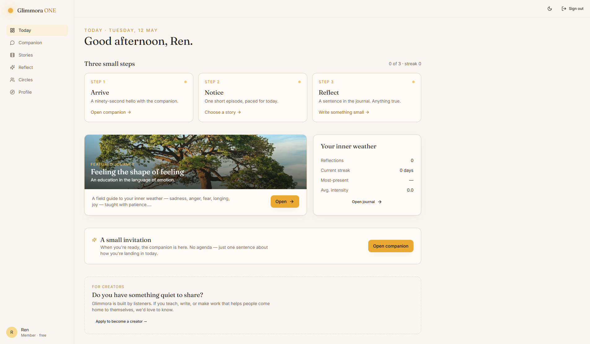

### 1.6 Step 1 — Arrive (Companion)
**Do:** click **Step 1 — Open companion**. On the empty state, click a starter or type a sentence.
**Expected:** companion responds within a few seconds. An emotion chip and a "question to sit with" appear. After sending one message, the dashboard's Step 1 will tick as done on next visit.
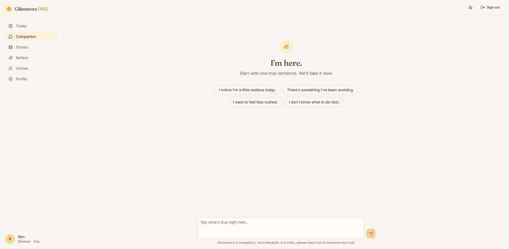

### 1.7 Crisis safety
**Do:** type a message containing explicit crisis language (e.g. *"I want to die tonight"*). Submit.
**Expected:** a rose-bordered safety card appears with regional helplines (India / US-Canada / UK-ROI / findahelpline.com). The companion continues to respond gently. This is detected client-server side by the regex `kill myself | end my life | suicide | suicidal | want to die | don't want to live | hurt myself | self-harm` — deliberately conservative; oblique language is **not** flagged.
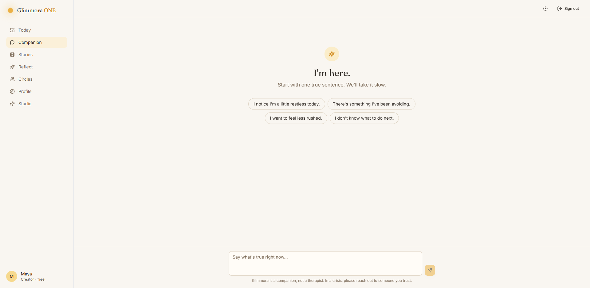

### 1.8 Step 2 — Notice (Stories)
**Do:** navigate to **Stories** in the sidebar. Pick a series, then an episode.
**Expected:** library shows three demo series grouped by category. Each series page shows hero, tags, and episode list with durations. Episode page renders the HLS-capable video player and the reflection prompt below.
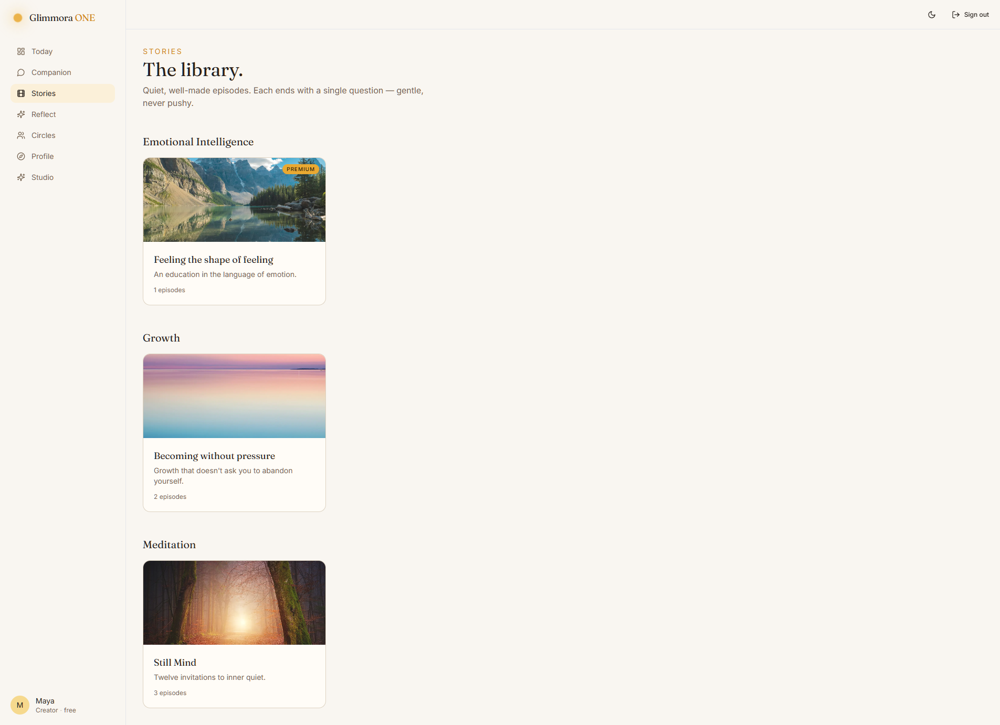
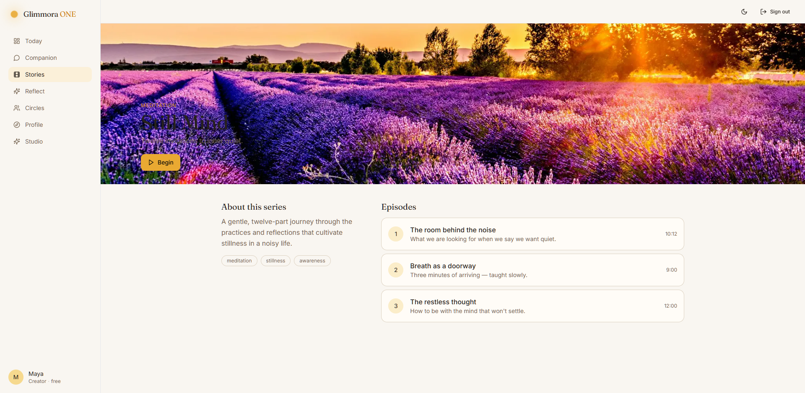

### 1.9 Step 3 — Reflect
**Do:** open `/reflect/new`, write a sentence, optionally pick a mood + intensity + threads, save.
**Expected:** redirects to `/reflect` (digest). Stats update: `Reflections: 1 · Day streak: 1 · Most-present: <mood>`. The 30-day band shows today's chip. The new entry appears in the journal column.
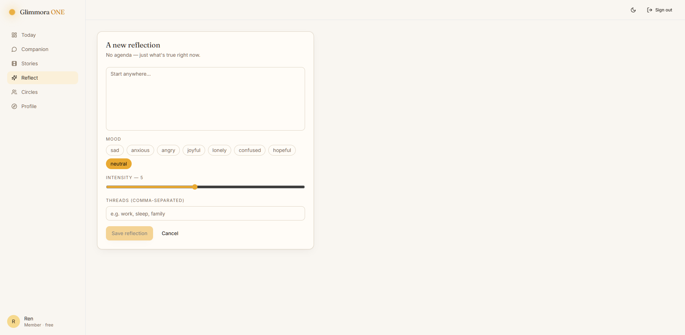
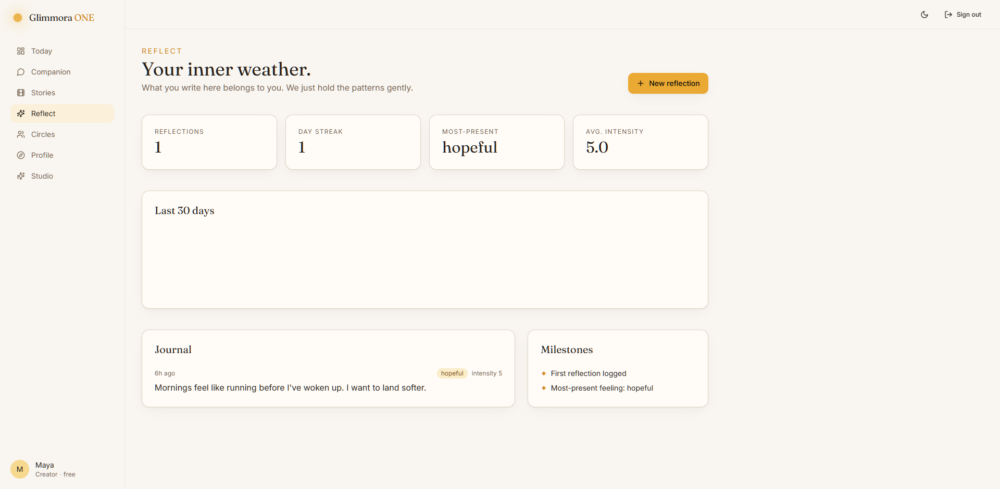

### 1.10 Circles
**Do:** open **Circles**.
**Expected:** three seeded circles (Becoming, First Light, The Quiet Circle). Each has an anonymous post box; you post under a handle chosen for you (not your username).
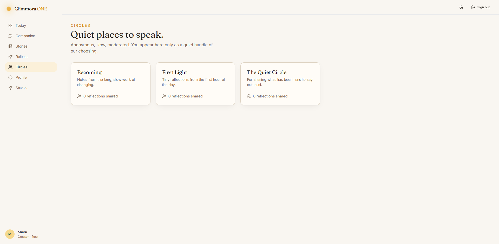

### 1.11 Profile
**Do:** open **Profile**.
**Expected:** three cards — **You** (editable name/bio/avatar), **Your role** (role label, blurb, role-aware CTA), **Membership** (current tier + Try premium / "thank you" message).
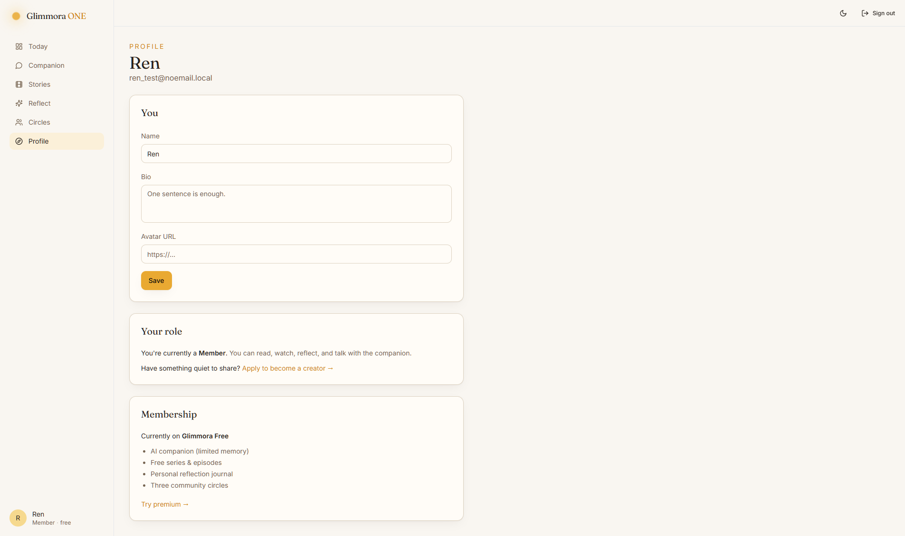

---

## 2. Member → Creator promotion flow

### 2.1 Apply
**Do:** as a member, open `/creator/apply`. Write a pitch (1–2000 chars), optionally a sample URL. Submit.
**Expected:** the same page now shows **YOUR APPLICATION — PENDING** with your pitch quoted. The dashboard's apply-CTA disappears and is replaced by a "We're reading your application" card. The Profile **Your role** card also reflects pending state.
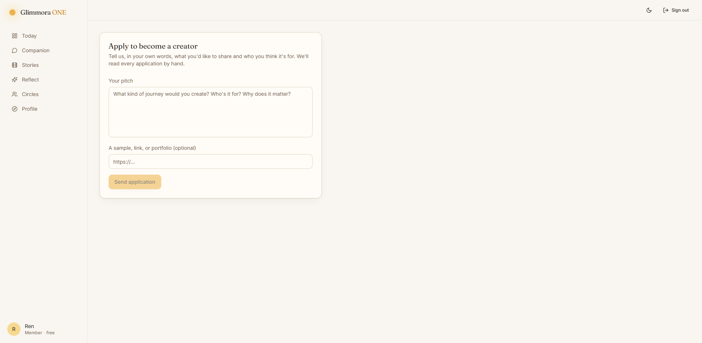

### 2.2 Admin reviews
**Do:** sign out, log in as `superadmin / ChangeMe!2026`. Skip onboarding (or complete it). Open **Admin**.
**Expected:** the **Creator applications** section lists the pending application. Click **Approve**.
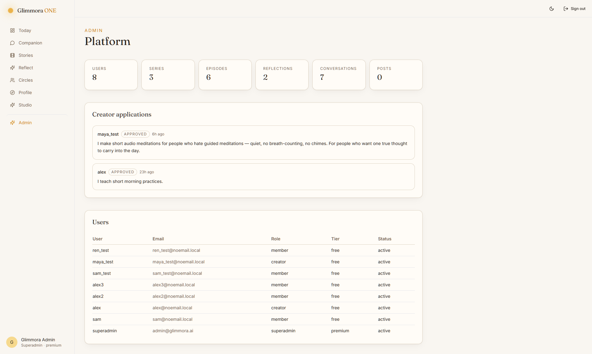

### 2.3 Promotion takes effect
**Do:** sign out, log back in as the original applicant.
**Expected:** sidebar role chip flips to **Creator · free**. A new **Studio** link appears in the sidebar. Profile **Your role** card now shows "You can publish series and episodes through Studio" + Open Studio link.
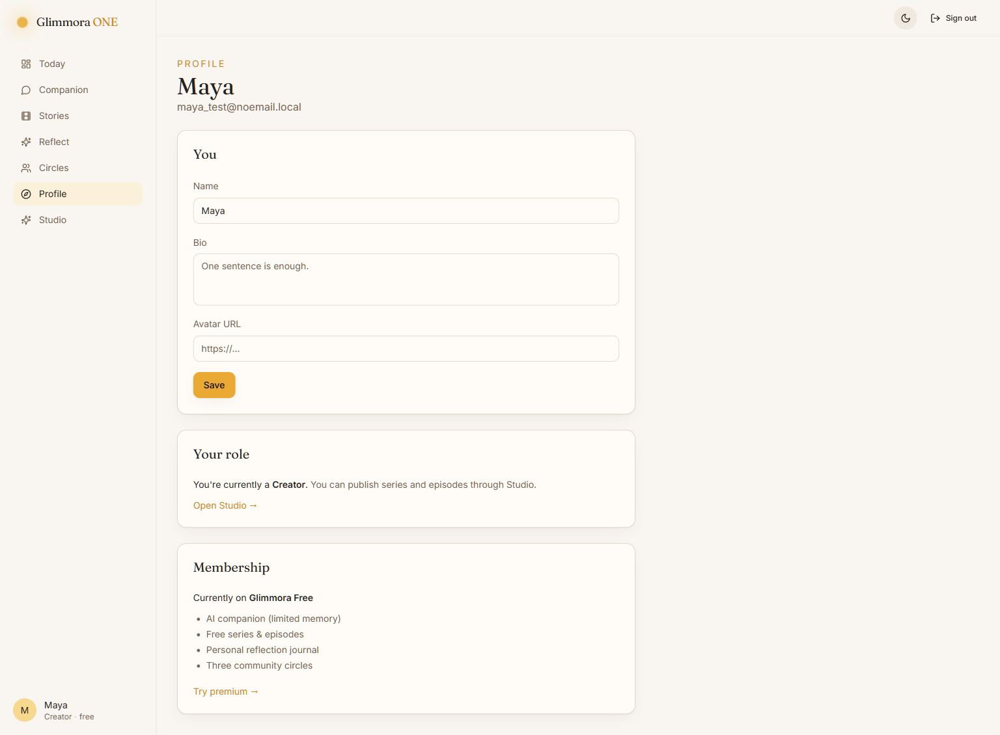

### 2.4 Publish a series + episode
**Do:** go to `/creator`. Create a series (`/creator/series/new`), then add episodes (`/creator/series/[id]/episodes/new`).
**Expected:** the series and its episodes appear in the public library after publishing, tier-gated as set.
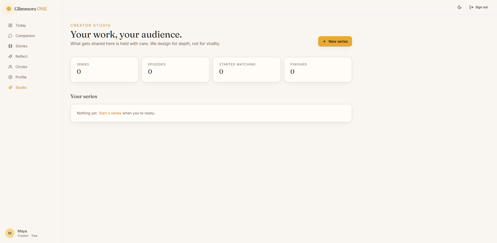

---

## 3. Role-by-role checklist

### 3.1 Anonymous visitor
- [ ] `/` renders without auth.
- [ ] `/pricing` renders.
- [ ] `/login` and `/signup` render with theme toggle visible.
- [ ] Any protected route (`/dashboard`, `/companion`, etc.) → 307 to `/login?next=…`.
- [ ] Theme toggle persists across reloads.

### 3.2 Member (default after signup)
- [ ] Brand-new signup goes **straight to `/onboarding`** (no `/dashboard` flicker).
- [ ] Onboarding can be skipped from any step.
- [ ] Cannot revisit `/onboarding` once onboarded (redirects to `/dashboard`).
- [ ] Sidebar shows `Member · <tier>`.
- [ ] No **Studio** link, no **Admin** link.
- [ ] `/admin` → 403 / redirect.
- [ ] `/creator` → 403 / redirect.
- [ ] Premium-tier episodes display a paywall hint; free episodes play.
- [ ] After applying as a creator, the apply CTA on dashboard hides; pending state shows in Profile.

### 3.3 Creator
- [ ] All Member behavior plus:
- [ ] Sidebar shows **Studio** link.
- [ ] `/creator` renders studio (series list, analytics, application status).
- [ ] Can create series and episodes.
- [ ] `/admin` still 403.
- [ ] Profile **Your role** card shows creator blurb + Open Studio link.

### 3.4 Admin / Superadmin
- [ ] All Creator behavior plus:
- [ ] Sidebar shows **Admin** link.
- [ ] `/admin` renders platform stats (users / series / episodes / reflections / conversations / posts), creator-application list with Approve/Deny, users table.
- [ ] Approve flips the user's role to `creator` and stamps `decided_by` / `decided_at`.
- [ ] Deny stamps decision but does not change role; user can re-apply.
- [ ] Superadmin can do everything admin can; admin cannot demote a superadmin (back-end guard).

---

## 4. Cross-cutting checks

- **Cookies**: session cookie is `glimmora_session`, httpOnly. JS cannot read it. `secure` flag is **off** in dev (so http://127.0.0.1 works) and **on** in production builds.
- **API envelope**: every backend response is `{ success, data, error }`. Frontend `backend()` / `backendData()` unwraps.
- **CamelCase boundary**: backend serializes snake_case → camelCase via `pydantic.alias_generators.to_camel`. UI consumes camelCase only.
- **Crisis regex** (`backend/app/ai/companion.py:58`): deliberately conservative. If a tester reports "didn't flag X", verify against the regex before changing — false positives are worse than false negatives here.
- **Onboarding flag**: stored in `User.preferences.onboarded`. Set true when the user finishes (including Skip). The `(app)` layout redirects un-onboarded users.

---

## 5. Regressions to watch

1. **Blank flash after signup** — historically caused by chained `redirect()` across server actions + layouts. Fixed by having `signupAction` redirect directly to `/onboarding` (`apps/web/src/lib/auth-actions.ts:51`). If this regresses, you'll see an empty body for ~1s after submit.
2. **Pydantic email validation rejecting `.local` TLD** — `UserPublic.email` and `AdminUserRow.email` are plain `str`, not `EmailStr`. Don't "fix" them back.
3. **SQLAlchemy `greenlet_spawn` in chat** — never assign `conv.messages = []`. Pass an empty list explicitly to the AI helper.
4. **Old uvicorn holding port 8000** — kill the previous process before restarting.

---

## 6. Quick smoke (60 sec)

```bash
# Backend health
curl -s http://127.0.0.1:8000/health
# Frontend
curl -s -o /dev/null -w "%{http_code}\n" http://127.0.0.1:3000/
# Signup + me
curl -s -c /tmp/c.jar -X POST http://127.0.0.1:8000/v1/auth/signup \
  -H 'content-type: application/json' \
  -d '{"username":"smoke","password":"hi"}' | jq .success
```

All three should return success / 200.
